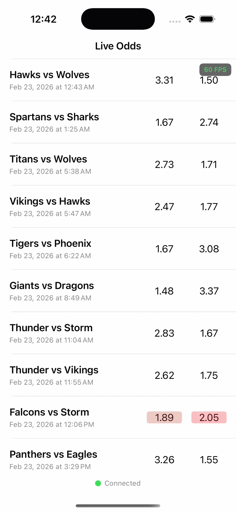

# LiveOdds iOS 架構說明

## 1. Swift Concurrency vs Combine 使用場景

| 技術 | 使用場景 | 範例 |
|------|----------|------|
| **Actor** | 保護共享可變狀態 | `MatchesStore`, `StateCacheManager` |
| **@MainActor** | UI 狀態管理 | `MatchListViewModel` 全類別標記 |
| **async let** | 並行 API 請求 | 同時取得 matches 和 odds |
| **Combine @Published** | ViewModel → View 狀態綁定 | `viewState`, `connectionState` |
| **PassthroughSubject** | 一次性事件通知 | `rowsToUpdate` 發送需更新的列 |
| **collect(.byTime)** | 高頻更新批次處理 | WebSocket 賠率更新每 200ms 合併 |

---

## 2. Thread-Safety 策略

```
@MainActor ViewModel ──await──▶ actor MatchesStore
                     ──await──▶ actor StateCacheManager
```

- **Actor**：資料層自動序列化存取，無需手動加鎖
- **@MainActor**：ViewModel 所有屬性/方法保證在主執行緒
- **Sendable struct**：跨 Actor 傳遞不可變資料（如 `StoreSnapshot`）

---

## 3. UI 與 ViewModel 資料綁定

```
ViewController                    ViewModel (@MainActor)
     │                                  │
     ├── $viewState.sink ◀─────────── @Published viewState
     ├── $connectionState.sink ◀───── @Published connectionState
     ├── rowsToUpdate.sink ◀───────── PassthroughSubject
     │                                  │
     └── tableView.dataSource ────────▶ cachedDisplayData (同步存取)
```

**關鍵設計**：UITableViewDataSource 需同步返回，所以 ViewModel 維護 `cachedDisplayData` 字典供 `cellForRowAt` 直接讀取。

---

## 4. WebSocket 斷線自動重連

```
斷線 → ReconnectionManager (actor) → 指數退避重試 → 成功/達上限
```

- **指數退避**：重試間隔 2^n 秒（1s → 2s → 4s...），上限 30 秒
- **狀態通知**：透過 `ConnectionState` 即時顯示重連進度與倒數
- **可取消**：用戶手動操作或成功連線時取消重試 Task

---

## 5. 快取機制

```
畫面釋放前 → cache(snapshot) → StateCacheManager (Singleton)
重新進入  → retrieve() → 立即恢復 → 重連 WebSocket
```

- **快取內容**：`StoreSnapshot`（比賽列表 + 賠率 + 索引映射）
- **儲存位置**：`StateCacheManager` Singleton（記憶體）
- **優勢**：即使畫面被釋放，只要 repository 還在，重新進入即可快速恢復狀態

---

## 6. Demo 
- 展示賠率更新、排序與FPS指標
  
  

 
